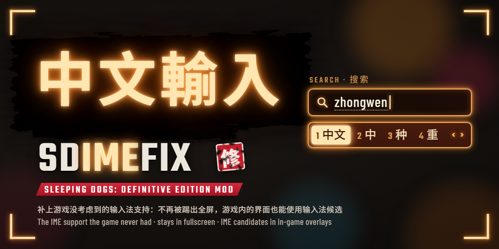

# Sleeping Dogs: Definitive Edition — IME fix (SDIMEFix)



> [!IMPORTANT]
> **关于这个 mod**：它完全是用 Claude Code 里的 Claude Fable 和 Opus vibe coding 写出来的，几乎没有经过审查，请当作实验性质的 mod 使用，发现异常请反馈。作为一个长期缺少 mod 而自己下场做 mod 的普通玩家，我在 vibe 的过程中收获了许多快乐；如果你也有想实现的灵感，不妨也试着 vibe 一下。由于这些代码都是 vibe 出来的，所以我不会以我的 mod 盈利，也不接受捐助。如果你喜欢我的作品，请给[致谢](#致谢)中提到的开源项目点个 star，也可以考虑向这些项目和作者捐赠（如果他们接受捐赠的话），祝你游玩愉快！
>
> **About this mod**: it was fully vibe-coded with Claude Fable and Opus in Claude Code, with little review, so treat
> it as experimental and please report anything unusual. I'm just an ordinary player who went a long time without
> mods for this game and finally started making them myself. Vibe coding them has been a lot of fun; if you have an
> idea of your own, it might be for you too. Since all this code is vibe-coded, I won't make money from my mods and
> don't accept donations. If you like my work, please star the open-source projects listed in the
> [Credits](#credits) instead, and consider donating to them and their authors if they accept donations. Have fun!

[中文](#中文) | [English](#english)

## 中文

开着中文输入法玩《热血无赖：终极版》时，一按 Shift 或 WASD 就会弹出拼音框，游戏从全屏掉回窗口。装上这个 mod 后：

- 游戏里输入法不会再弹出来，中文输入法可以一直开着玩；
- 游戏在前台时，Ctrl+Shift、Alt+Shift、Win+Space 不会切换输入法；
- 装了 ReShade 的话，可以在 ReShade 的界面里直接打中文（可选，见[常见问题](#常见问题)）。

它不改动游戏原有的文件，也不影响存档，删掉就能卸载。

> 适用于**任何版本**的《热血无赖：终极版》，Windows 10/11 64 位。只想换设置、已经装过其他 mod，或者想自己编译，请看 [ADVANCED.md](ADVANCED.md)。

### 安装（大约两分钟）

**第 1 步：下载**

点这里下载 **[SDIMEFix.zip](https://github.com/aUsernameWoW/sleeping-dogs-ime-fix/releases/latest/download/SDIMEFix.zip)**。也可以在 [Nexus Mods](https://www.nexusmods.com/sleepingdogsdefinitiveedition/mods/172?tab=files) 的 Files
页面下载主文件 “SDIMEFix”，内容相同。

压缩包里只有这些：

```text
dinput8.dll                  ← Ultimate ASI Loader：让游戏加载 mod 的“加载器”
plugins\
    SDIMEFix.asi             ← mod 本体
    SDIMEFix-THIRD-PARTY-NOTICES.md
```

**第 2 步：打开游戏文件夹**

1. 打开 Steam，进入「库」。
2. 在左侧列表里右键点「Sleeping Dogs: Definitive Edition」→「管理」→「浏览本地文件」。
3. 弹出来的就是游戏文件夹，里面有 `sdhdship.exe`（如果电脑不显示扩展名，就是一个叫 `sdhdship` 的程序）。

一般在 `C:\Program Files (x86)\Steam\steamapps\common\SleepingDogsDefinitiveEdition`，装在别的盘时路径会不一样。不是 Steam 版的话，打开游戏的安装文件夹（游戏主程序 `.exe` 所在的地方）就行，后面的步骤一样。

**第 3 步：把文件放进去**

1. 双击打开下载的 `SDIMEFix.zip`。
2. 选中里面的 `dinput8.dll` 和 `plugins` 文件夹，一起拖进第 2 步打开的游戏文件夹。
3. 如果 Windows 弹出「替换或跳过文件」，说明游戏文件夹里已经有 `dinput8.dll` 了（你以前装过别的 mod，加载器已经在了），选「跳过该文件」。已有的 `plugins` 文件夹会自动合并，不用管。

放好后，游戏文件夹里应该是这样（只列出相关的部分）：

```text
SleepingDogsDefinitiveEdition\
    sdhdship.exe
    dinput8.dll
    plugins\
        SDIMEFix.asi
```

注意 `dinput8.dll` 要和 `sdhdship.exe` 在同一层。常见的错误是多套了一层文件夹，比如
`SleepingDogsDefinitiveEdition\SDIMEFix\plugins\...`，这样游戏找不到它。

**第 4 步：启动游戏，确认装好了**

照常从 Steam 启动游戏，看到游戏画面后就可以退出。回到游戏文件夹打开 `plugins`，如果里面多了 `SDIMEFix.ini`
和 `SDIMEFix.log` 两个文件，就说明装好了。

之后切到中文输入法进游戏，按 Shift、用 WASD 走路，拼音框不会再出现，游戏也不会掉出全屏。

### 常见问题

**`plugins` 里没有出现 `SDIMEFix.ini`**

说明 mod 没有被加载，依次检查：

- `dinput8.dll` 是不是直接放在游戏文件夹里、和 `sdhdship.exe` 在一起（而不是放进了 `plugins` 或其他子文件夹）；
- `SDIMEFix.asi` 是不是在 `plugins` 文件夹里；
- 杀毒软件（包括 Windows 安全中心）有没有删掉或隔离 `dinput8.dll`。ASI 加载器的原理是让游戏把它当成系统文件加载，偶尔会被误报。可以在隔离区里还原它，并把游戏文件夹加入排除项；
- 如果第 3 步跳过了游戏文件夹里原有的 `dinput8.dll`，那个文件可能不是 ASI 加载器。把它备份到别处，再换成压缩包里的这个。

**装了之后游戏打不开**

先把 `plugins\SDIMEFix.asi` 移出游戏文件夹再试。如果还是打不开，问题不在这个 mod；如果能打开了，请按下面的方法反馈。

**想在 ReShade 里打中文**

需要安装带完整插件支持的 ReShade（安装包名字里有 “Addon”，也就是 “with full add-on support” 版本），目前只支持 **ReShade 6.8.0**。装好后按 Home 打开 ReShade，在搜索框里就能用输入法打字，候选词直接显示在
ReShade 界面里。用其他版本的 ReShade 时只是这一项不起作用，其余功能照常。

**想关掉某项功能**

用记事本打开 `plugins\SDIMEFix.ini`，把对应项的 `1` 改成 `0`，保存后重启游戏。每一项都有中文说明。

**以前装过 SDInputFix**

那是这个 mod 以前的名字。删掉 `plugins\SDInputFix.asi`，不然新旧两个版本会同时运行。想保留原来的设置的话，把 `SDInputFix.ini` 改名为 `SDIMEFix.ini`。

**更新**

下载新的 `SDIMEFix.zip`，只把里面的 `plugins` 文件夹拖进游戏文件夹，Windows 询问时选「替换目标中的文件」。`SDIMEFix.ini` 不在压缩包里，你的设置会保留。

**卸载**

删掉 `plugins` 里的 `SDIMEFix.asi`、`SDIMEFix.ini` 和 `SDIMEFix.log`。如果 `plugins` 里已经没有其他
`.asi` 文件了（也就是没有别的 mod 了），`dinput8.dll` 也可以删掉。

**遇到问题怎么反馈**

在 [GitHub Issues](https://github.com/aUsernameWoW/sleeping-dogs-ime-fix/issues) 或 Nexus Mods 页面的
Bugs 标签里说明情况，并附上 `plugins\SDIMEFix.log`。它记录了 mod 每一步做了什么，通常看一眼就能找到原因。

### 致谢

这个 mod 用到或参考了下面这些人和项目的成果，在此致谢。

**研究资料**

- [SDmodding](https://github.com/SDmodding)，几乎全部出自 [sneakyevil](https://github.com/sneakyevil) 一人之手。这个 mod 用到了：
  - SDmodding 随 [SDK](https://github.com/SDmodding/SDK) 发布的 [Visual Studio 2022 项目模板](https://github.com/SDmodding/SDK/releases/tag/vs2022)：这个 mod 的 Visual Studio 工程源自这个模板，编译设置和以 `dllmain.cc` 为起点的源文件结构都来自它；
  - SDmodding 分享的游戏 v1.0 版 exe 和调试符号（PDB，Steam 首发版自带）：用来研究游戏怎样创建窗口、读取键盘输入；
  - [BigFileSystem](https://github.com/SDmodding/BigFileSystem)、[TheoryEngine](https://github.com/SDmodding/TheoryEngine)，以及 sneakyevil 的 [SD-BigFileExplorer](https://github.com/sneakyevil/SD-BigFileExplorer) 和 [Ekey](https://github.com/Ekey) 的 SDDEUnpacker 里的文件名列表：读取游戏资源包（`.big`）的工具是照着它们写的，横幅图参照的游戏界面贴图就是用它取出的。

**mod 里包含的代码**（许可证全文见 [THIRD-PARTY-NOTICES.md](THIRD-PARTY-NOTICES.md)）

- [Ultimate ASI Loader](https://github.com/ThirteenAG/Ultimate-ASI-Loader)（ThirteenAG）：压缩包里的 `dinput8.dll`，让游戏加载 mod。它本身还包含 MinHook、[miniz](https://github.com/richgel999/miniz)（Rich Geldreich 等）和 [praydog](https://github.com/praydog) 的 FunctionHookMinHook。
- [ReShade](https://github.com/crosire/reshade)（crosire）的插件接口和 [Dear ImGui](https://github.com/ocornut/imgui)（Omar Cornut）：在 ReShade 界面里输入中文；把文字交给 ImGui 的那段代码改编自 Dear ImGui。

**参考与灵感**

- [InputFix](https://github.com/zlainsama/InputFix)（zlainsama）等 Minecraft 输入法修复 mod：这个 mod 的思路来自它们。
- [PowerToys](https://github.com/microsoft/PowerToys)（Microsoft）：屏蔽 Win+空格时不让开始菜单弹出，用的是和它一样的办法。
- Microsoft Learn 上的[输入法管理器（IMM32）文档](https://learn.microsoft.com/windows/win32/intl/input-method-manager)。

**工具**

- [IDA Pro](https://hex-rays.com/ida-pro)（Hex-Rays）和 [ida-pro-mcp](https://github.com/mrexodia/ida-pro-mcp)（mrexodia）：分析游戏程序。
- [Claude Code](https://claude.com/claude-code)（Anthropic）：这个 mod 完全是用 Claude Fable 和 Opus vibe coding 写出来的，代码、文档和逆向分析都出自 Claude，几乎没有经过人工审查。
- 字体 [Noto Sans SC/TC](https://fonts.google.com/noto)、[Teko](https://fonts.google.com/specimen/Teko)、[Barlow Condensed](https://fonts.google.com/specimen/Barlow+Condensed)：横幅图和图标。

**游戏与商标**

《热血无赖：终极版》（Sleeping Dogs: Definitive Edition）由 United Front Games 开发、Square Enix 发行，游戏及其内容的版权归 Square Enix 所有。横幅图和图标仿照游戏的菜单界面重新绘制，没有使用游戏原图。Windows 和 PowerToys 是 Microsoft 的商标。

与 Square Enix、United Front Games、Microsoft 均无关联。

## English

With a Chinese (or other CJK) IME turned on, pressing Shift or WASD in Sleeping Dogs: Definitive Edition
pops up the IME's input box and drops the game out of fullscreen. With this mod:

- the IME no longer pops up in game, so you can leave it on while you play;
- Ctrl+Shift, Alt+Shift and Win+Space don't switch input languages while the game is in front;
- if you use ReShade, you can type with the IME in its overlay (optional, see [FAQ](#faq)).

It changes none of the game's own files and doesn't touch your saves; deleting it uninstalls it.

> Works with **any version** of Sleeping Dogs: Definitive Edition, Windows 10/11 64-bit. To change settings,
> add it to an existing mod setup or build it yourself, see [ADVANCED.md](ADVANCED.md).

### Installing (about two minutes)

**Step 1: download**

Download **[SDIMEFix.zip](https://github.com/aUsernameWoW/sleeping-dogs-ime-fix/releases/latest/download/SDIMEFix.zip)**.
The main file "SDIMEFix" on the Files tab of [Nexus Mods](https://www.nexusmods.com/sleepingdogsdefinitiveedition/mods/172?tab=files)
is the same thing.

The zip holds only this:

```text
dinput8.dll                  ← Ultimate ASI Loader: the "loader" that makes the game load mods
plugins\
    SDIMEFix.asi             ← the mod itself
    SDIMEFix-THIRD-PARTY-NOTICES.md
```

**Step 2: open the game folder**

1. Open Steam and go to your Library.
2. Right-click "Sleeping Dogs: Definitive Edition" in the list on the left → Manage → Browse local files.
3. The folder that opens is the game folder. It contains `sdhdship.exe` (shown as just `sdhdship` if
   Windows hides file extensions).

It is usually `C:\Program Files (x86)\Steam\steamapps\common\SleepingDogsDefinitiveEdition`, or the same
path on another drive. For a non-Steam copy, open the game's install folder (where the game's `.exe` is);
the remaining steps are the same.

**Step 3: copy the files in**

1. Double-click the downloaded `SDIMEFix.zip` to open it.
2. Select `dinput8.dll` and the `plugins` folder inside and drag both into the game folder from step 2.
3. If Windows shows "Replace or Skip Files", the game folder already has a `dinput8.dll` (you already have a
   loader from another mod): choose "Skip this file". An existing `plugins` folder is merged automatically.

Afterwards the game folder should look like this (only the relevant parts):

```text
SleepingDogsDefinitiveEdition\
    sdhdship.exe
    dinput8.dll
    plugins\
        SDIMEFix.asi
```

`dinput8.dll` has to sit next to `sdhdship.exe`. A common mistake is an extra folder level, e.g.
`SleepingDogsDefinitiveEdition\SDIMEFix\plugins\...`; the game won't find the mod there.

**Step 4: start the game and check**

Start the game from Steam as usual; once you see the game you can quit. Open the `plugins` folder: if it
now contains `SDIMEFix.ini` and `SDIMEFix.log`, the mod is installed.

From now on, with your IME on, Shift and WASD in game no longer bring up its input box or drop the game out
of fullscreen.

### FAQ

**No `SDIMEFix.ini` appeared in `plugins`**

The mod wasn't loaded. Check that:

- `dinput8.dll` is directly in the game folder, next to `sdhdship.exe` (not in `plugins` or another
  subfolder);
- `SDIMEFix.asi` is in the `plugins` folder;
- your antivirus (including Windows Security) didn't delete or quarantine `dinput8.dll`. ASI loaders work by
  getting the game to load them in place of a system file, which is sometimes flagged by mistake. Restore it
  from quarantine and add the game folder as an exclusion;
- if you skipped an existing `dinput8.dll` in step 3, that file may not be an ASI loader. Move it somewhere
  safe and use the one from the zip instead.

**The game doesn't start any more**

Move `plugins\SDIMEFix.asi` out of the game folder and try again. If the game still doesn't start, this mod
isn't the cause; if it does, please report it (see below).

**Typing into ReShade**

You need ReShade with full add-on support (the installer with "Addon" in its name), and currently only
**ReShade 6.8.0** works. Press Home to open ReShade and type into its search box with your IME; the
candidates are shown inside ReShade. With other ReShade versions only this part doesn't work; everything
else does.

**Turning a feature off**

Open `plugins\SDIMEFix.ini` in Notepad, change the setting's `1` to `0`, save, and restart the game. Every
setting is explained in the file.

**I had SDInputFix installed**

That's this mod's old name. Delete `plugins\SDInputFix.asi`, or the old and new versions will both run. To
keep your settings, rename `SDInputFix.ini` to `SDIMEFix.ini`.

**Updating**

Download the new `SDIMEFix.zip` and drag only its `plugins` folder into the game folder; when Windows asks,
choose "Replace the files in the destination". `SDIMEFix.ini` isn't in the zip, so your settings stay.

**Uninstalling**

Delete `SDIMEFix.asi`, `SDIMEFix.ini` and `SDIMEFix.log` from `plugins`. If no other `.asi` files are left in
`plugins` (no other mods), you can delete `dinput8.dll` too.

**Reporting a problem**

Describe it in [GitHub Issues](https://github.com/aUsernameWoW/sleeping-dogs-ime-fix/issues) or on the Bugs
tab of the Nexus Mods page, and attach `plugins\SDIMEFix.log`. It records what the mod did, step by step,
which usually shows what went wrong.

### Credits

This mod uses or builds on the work of these people and projects. Thank you.

**Research**

- [SDmodding](https://github.com/SDmodding), almost all of it the work of one person, [sneakyevil](https://github.com/sneakyevil). This mod used:
  - the [Visual Studio 2022 project template](https://github.com/SDmodding/SDK/releases/tag/vs2022) released with SDmodding's [SDK](https://github.com/SDmodding/SDK): the mod's Visual Studio project derives from it, including its build settings and the source layout that starts at `dllmain.cc`;
  - the game's v1.0 exe and its debug symbols (PDB, shipped with the original Steam release), shared by
    SDmodding: used to study how the game creates its window and reads the keyboard;
  - [BigFileSystem](https://github.com/SDmodding/BigFileSystem), [TheoryEngine](https://github.com/SDmodding/TheoryEngine), and the file name lists in sneakyevil's [SD-BigFileExplorer](https://github.com/sneakyevil/SD-BigFileExplorer) and in [Ekey](https://github.com/Ekey)'s
    SDDEUnpacker: the tool that reads the game's `.big` archives follows them; the game's UI textures the banner is modelled on were taken out with it.

**Code in the mod** (full license texts in [THIRD-PARTY-NOTICES.md](THIRD-PARTY-NOTICES.md))

- [Ultimate ASI Loader](https://github.com/ThirteenAG/Ultimate-ASI-Loader) (ThirteenAG): the `dinput8.dll` in the zip, which makes the game load mods.
  It contains MinHook, [miniz](https://github.com/richgel999/miniz) (Rich Geldreich and others) and [praydog](https://github.com/praydog)'s FunctionHookMinHook.
- [ReShade](https://github.com/crosire/reshade) (crosire) add-on API and [Dear ImGui](https://github.com/ocornut/imgui) (Omar Cornut): typing Chinese into ReShade's overlay; the
  code that hands the text to ImGui is adapted from Dear ImGui.

**References and inspiration**

- [InputFix](https://github.com/zlainsama/InputFix) (zlainsama) and the other Minecraft IME fix mods: where the idea
  came from.
- [PowerToys](https://github.com/microsoft/PowerToys) (Microsoft): blocking Win+Space without the Start menu popping
  up works the same way it does there.
- Microsoft Learn's [Input Method Manager (IMM32) documentation](https://learn.microsoft.com/windows/win32/intl/input-method-manager).

**Tools**

- [IDA Pro](https://hex-rays.com/ida-pro) (Hex-Rays) and [ida-pro-mcp](https://github.com/mrexodia/ida-pro-mcp) (mrexodia): analyzing the game's code.
- [Claude Code](https://claude.com/claude-code) (Anthropic): this mod was fully vibe-coded with Claude Fable and Opus; its code,
  documentation and reverse engineering are all Claude's, with little human review.
- The fonts [Noto Sans SC/TC](https://fonts.google.com/noto), [Teko](https://fonts.google.com/specimen/Teko) and [Barlow Condensed](https://fonts.google.com/specimen/Barlow+Condensed): the banner and the icon.

**The game and trademarks**

Sleeping Dogs: Definitive Edition was developed by United Front Games and published by Square Enix; the game
and its content are © Square Enix. The banner and the icon redraw the look of the game's menus; no game art is used in them. Windows and PowerToys are trademarks of Microsoft.

Not affiliated with Square Enix, United Front Games or Microsoft.
